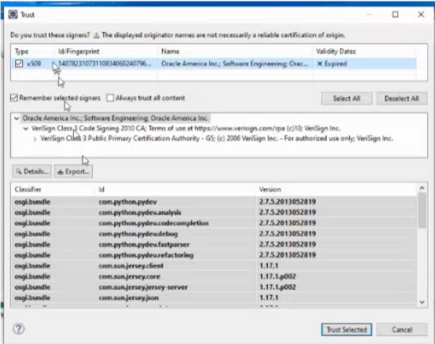
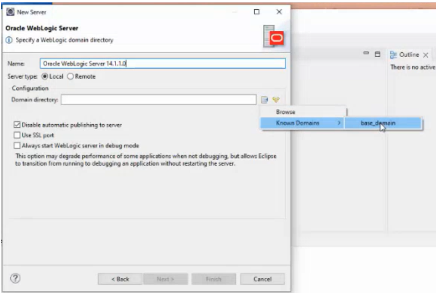
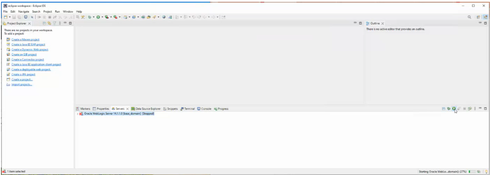
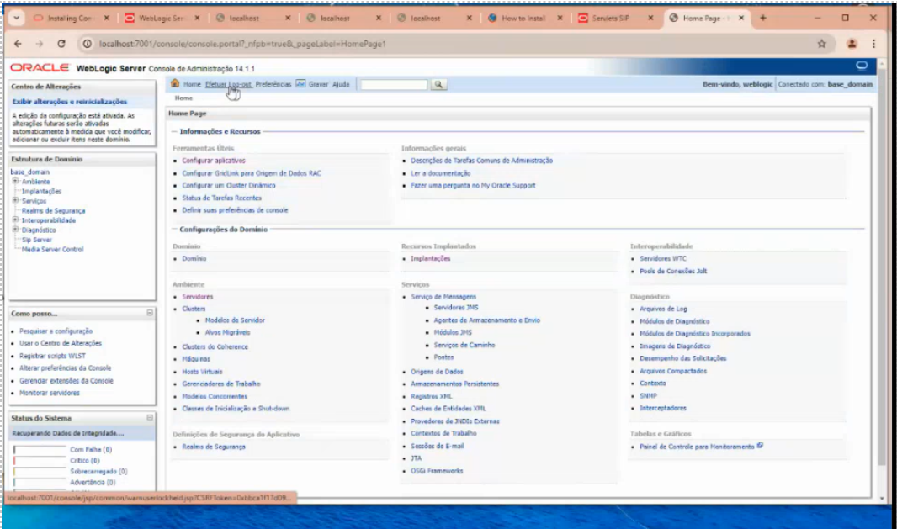
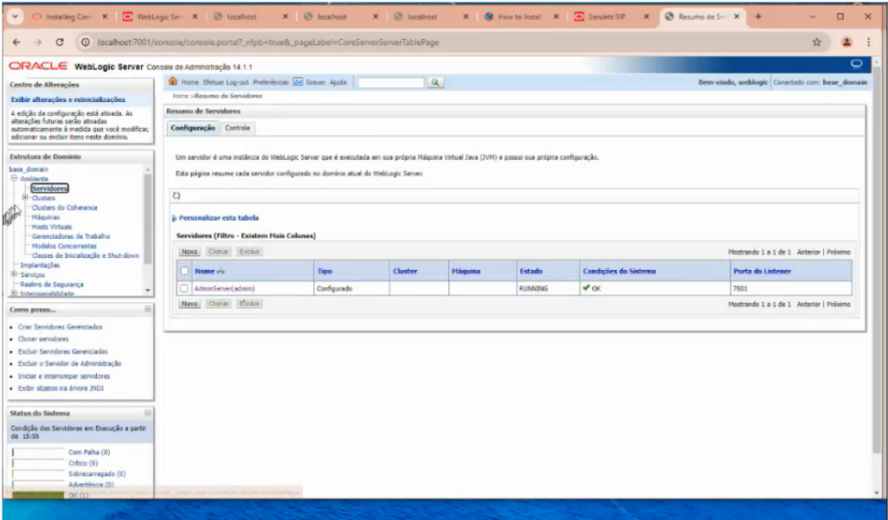
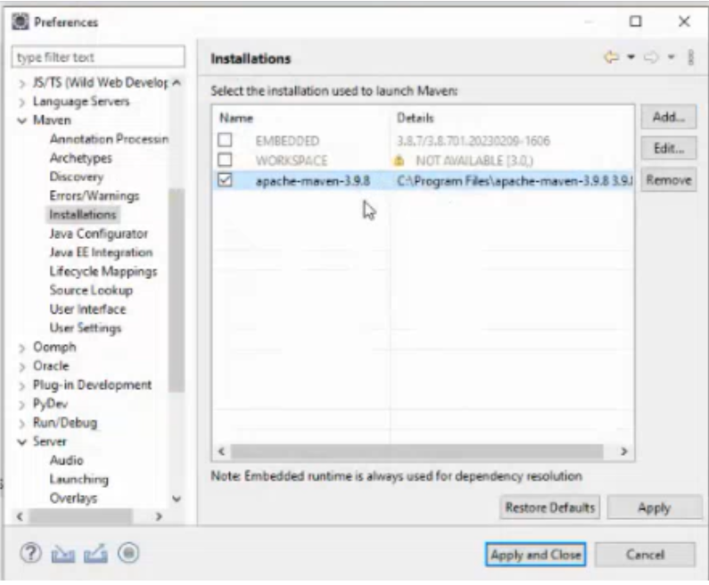
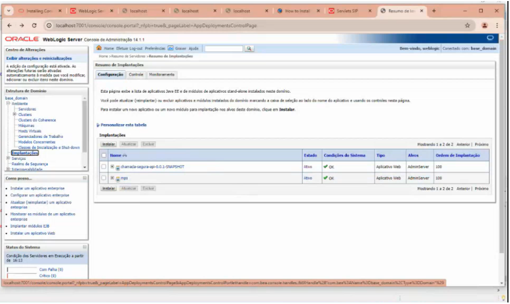
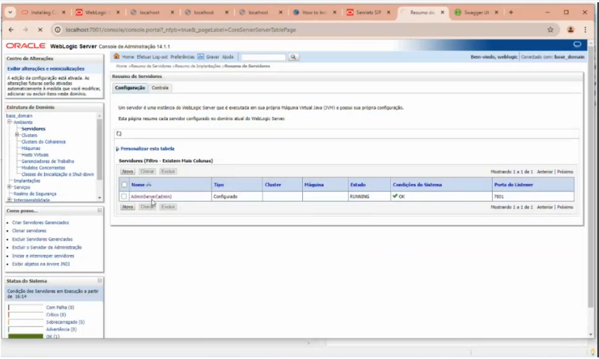
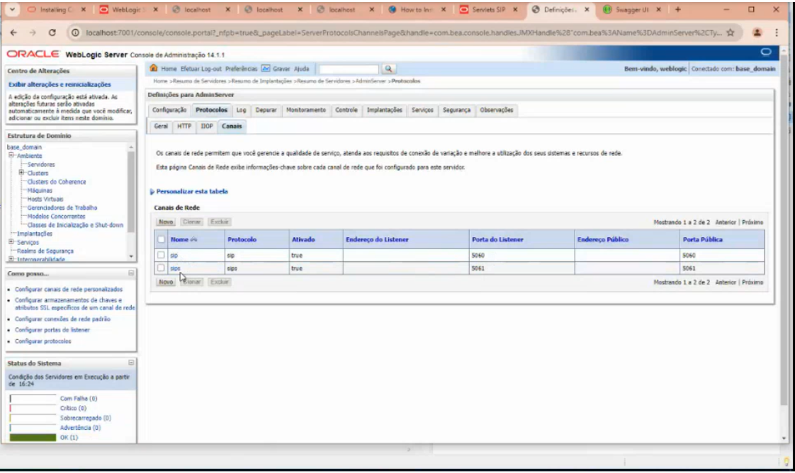

# SIPCall

SIPCall é um projeto que integra chamadas telefônicas via protocolo SIP com aplicações web Java, combinando o poder do Oracle Communications Converged Application Server (OCCAS) com a flexibilidade do Spring Boot. Ele fornece uma base sólida para o desenvolvimento de aplicações de comunicação em tempo real, como chamadas VoIP, com suporte tanto a requisições HTTP quanto a sessões SIP, utilizando servidores WebLogic para deploy.

A aplicação pode ser testada com dois softphones instalados localmente, sugiro o Linphone e o MicroSIP, permitindo simular chamadas entre extensões configuradas. Este repositório documenta todo o processo de instalação, configuração e implantação, servindo como um guia prático para desenvolvedores que desejam explorar soluções corporativas baseadas em SIP e Java.

# Guia de Instalação e Configuração do Ambiente OCCAS + Eclipse + Maven + WebLogic

## Instalação do OCCAS 

O OCCAS precisa do SDK 11 para ser instalado, primeiro passo é instalar o Java SDK 11 (Adicionar o PATH e verificar no cmd `java --version`) 

Descompactar o `occas_generic.jar`, entre no diretório ao qual ele se encontra e no cmd (como administrador) dê o comando `java -jar occas_generic.jar` . Se não der nenhum erro é aberta uma janela de configuração do OCCAS. 

Na janela de configuração do OCCAS prossiga com *next* e escolha `Complete instalation` quando surgir essa opção, vá até instalar. Deixe marcado o Iniciar o assistente de configuração automaticamente.  

Já na tela do assistente mantenha o domínio *base_domain* escolhido (*isso para teste, se for para cliente pode personalizar um domínio com o nome do cliente ou outro nome*). Na próxima tela marque também `Converged Application Server – Base Domain`. Adiante mantenha o nome como weblogic e crie uma senha. Um pouco mais adiante selecione `Servidor de Administração`. Dê *next* e *criar* no final. 

Instalar o JDK 17, configurando o PATH corretamente, verificar com “java --version” no cmd se está tudo ok. 

## No Eclipse (versão 2023-03) 

Antes de iniciar, edite o arquivo `eclipse.ini` adicionando na última linha `--add-opens=java.base/sun.net.www.protocol.jar=ALL-UNNAMED` 

Selecione *Help > Install new Software, Work With > Add...*, o name vai ser `Oracle` e o Location: `http://download.oracle.com/otn_software/oepe/12.2.1.10/photon/repository/` , clique em add, 

A IDE vai conectar na lista de repositórios da Oracle, expanda a lista *Tools*, escolha as duas últimas opções:`Oracle WebLogic Scripting Tools` e `Oracle WebLogic Server Tools`. Após baixar as dependências dê next até aceitar todas as licenças de todos os pacotes. 

Após baixar as dependências confie no certificado da Oracle e dê Trust Selected: 



Depois clicar em *Window > Show View > Server*. Abaixo clique no link *No servers are available...*, expanda *Oracle* e clique em *Oracle WebLogic Server*. Verifique no *Runtime* se o JDK 11 está acionado. Clique em *next* até chegar no *Domain directory*. Faça a seguinte seleção abaixo e clique em *finish*.



Sendo assim é habilitada a opção do servidor e o botão verde para startar



## Configurando o Weblogic 

Após a instalação do OCCAS e configurações anteriores, é necessário que as opções *Sip Servlet* e *Media Server Control* estejam habilitadas na tela seguinte: 



Em “Ambiente” clique em “Servidores”, deve aparecer isso:



Antes de prosseguir é necessário instalar o Maven, descompacte o arquivo zip do Apache Maven em “C:\Arquivos de Programas”. 

Depois no Eclipse vá para *Window > Preferences*, clique na aba *Maven > Instalation*, clique em *Add > External*, adicione o Maven, dê finish e selecione a opção abaixo. 



Dê *Apply and close*.

## Instalar a biblioteca sip no projeto 

Clique no modulo chamada-segura-core com o botão direito e vá em propriedades, em *Target Runtime* escolha Oracle Weblogic, dê um *Apply*. Depois em *Java Build Path* clique em *add library > user library > user libraries > new*, nomeie como sip, clique no *system library*, clique em *add external jar*, na pasta *oracle* vá até *wlserver*, adentre até a pasta *sip* e escolha os 4 arquivos que possuem em seu nome a palavra *sip*. Depois de selecionar dê *apply and close*, e *finish*. 

## Configuração do Apache Maven no Eclipse

Na aba *Window* > *Preferences* > *Maven* > *Installations* > *Add* > *Directory* > (Buscar no diretório correto onde está o Apache-maven-3.9.8) > Clicar no botão *Apply and Close*

## Subindo o arquivo .war no Weblogic 

Para compilar o projeto dê *Run As > Maven install*. 

No módulo um, *chamada-segura-api*, na pasta *target*, estará o arquivo `.war` 

Voltando ao Weblogic clique em Implantações, clique em instalar, clique em *Faça upload do seu arquivo*, depois em *Arquivo Compactado de implantação* clique em *Escolher arquivo*, escolha o `.war` que já visualizamos antes na pasta `Target`, dê *próximo* duas vezes, clique em Instalar esta implantação como um aplicativo, dê próximo e clique em finalizar. Esse é o resultado: 



Novamente no Weblogic, em servidores, clique no servidor AdminServer 



Vá em protocolos, depois canais, assim vc verá os protocolos que estão rodando e suas respectivas portas: 



## Configuração para novo projeto utilizando Spring 

- Projeto novo criado no Initialzr (com Java 17):

  - Abrir projeto na IDE (com tudo já instalado nela)
  
### POM do projeto:

O POM é configurado para um projeto Spring Boot na versão 2.7.18, que é especificado pelo spring-boot-starter-parent. Ele está configurado para empacotar o projeto como um WAR, adequado para implantação em servidores de aplicativos. O projeto utiliza Java 11, como definido pela propriedade <java.version>. As principais dependências incluem spring-boot-starter-data-jpa para integração com JPA, spring-boot-starter-web para criar aplicações web, e mysql-connector-j na versão mais recente disponível para conectividade com o banco de dados MySQL se necessário. Também inclui spring-boot-devtools para facilitar o desenvolvimento com recursos como reinicialização automática, e springdoc-openapi-ui na versão 1.6.15 para documentação da API com Swagger. O maven-war-plugin é configurado para incluir recursos da pasta src/main/webapp. As versões das dependências são controladas por propriedades definidas, como spring.boot.version na versão 2.7.18, e a codificação UTF-8 é definida para o projeto, garantindo compatibilidade e consistência em todo o código.

Exemplo:

```
<?xml version="1.0" encoding="UTF-8"?>
<project xmlns="http://maven.apache.org/POM/4.0.0" xmlns:xsi="http://www.w3.org/2001/XMLSchema-instance"
    xsi:schemaLocation="http://maven.apache.org/POM/4.0.0 https://maven.apache.org/xsd/maven-4.0.0.xsd">
    <modelVersion>4.0.0</modelVersion>

    <groupId>br.com.sipcall</groupId>
    <artifactId>sipcall</artifactId>
    <version>0.0.1-SNAPSHOT</version>
    <name>sipcall</name>
    <packaging>war</packaging>

    <properties>
        <java.version>1.8</java.version>
        <spring.boot.version>2.7.18</spring.boot.version>
        <maven.compiler.source>${java.version}</maven.compiler.source>
        <maven.compiler.target>${java.version}</maven.compiler.target>
        <project.build.sourceEncoding>UTF-8</project.build.sourceEncoding>
    </properties>

    <dependencies>
        <!-- SPRING BOOT STARTER WEB -->
        <dependency>
            <groupId>org.springframework.boot</groupId>
            <artifactId>spring-boot-starter-web</artifactId>
            <version>${spring.boot.version}</version>
            <exclusions>
                <exclusion>
                    <groupId>org.springframework.boot</groupId>
                    <artifactId>spring-boot-starter-logging</artifactId>
                </exclusion>
                <exclusion>
                    <groupId>org.slf4j</groupId>
                    <artifactId>slf4j-log4j12</artifactId>
                </exclusion>
                <exclusion>
                    <groupId>log4j</groupId>
                    <artifactId>log4j</artifactId>
                </exclusion>
            </exclusions>
        </dependency>

		<!-- SPRING BOOT STARTER TEST -->
		<dependency>
		    <groupId>org.springframework.boot</groupId>
		    <artifactId>spring-boot-starter-test</artifactId>
		    <version>${spring.boot.version}</version>
		    <scope>test</scope>
        </dependency>

        <!-- SPRING BOOT STARTER TOMCAT -->
        <dependency>
            <groupId>org.springframework.boot</groupId>
            <artifactId>spring-boot-starter-tomcat</artifactId>
            <version>${spring.boot.version}</version>
            <scope>provided</scope>
        </dependency>

        <!-- SPRING BOOT DEVTOOLS -->
        <dependency>
            <groupId>org.springframework.boot</groupId>
            <artifactId>spring-boot-devtools</artifactId>
            <version>${spring.boot.version}</version>
            <scope>runtime</scope>
            <optional>true</optional>
        </dependency>

        <!-- SPRINGDOC OPENAPI -->
        <dependency>
            <groupId>org.springdoc</groupId>
            <artifactId>springdoc-openapi-ui</artifactId>
            <version>1.6.15</version>
        </dependency>
        
        <!-- JAKARTA ANNOTATION API -->
        <dependency>
            <groupId>jakarta.annotation</groupId>
            <artifactId>jakarta.annotation-api</artifactId>
            <version>3.0.0</version>
        </dependency>

        <!-- SPRING DATA JPA -->
        <dependency>
            <groupId>org.springframework.data</groupId>
            <artifactId>spring-data-jpa</artifactId>
            <version>2.7.18</version>
        </dependency>

        <!-- LOGGING DEPENDENCIES -->
        <dependency>
            <groupId>org.slf4j</groupId>
            <artifactId>slf4j-api</artifactId>
            <version>1.7.36</version>
        </dependency>

        <dependency>
            <groupId>org.slf4j</groupId>
            <artifactId>slf4j-jdk14</artifactId>
            <version>1.7.36</version>
        </dependency>
        
        <!-- MYSQL CONNECTOR -->
        <dependency>
		    <groupId>com.mysql</groupId>
		    <artifactId>mysql-connector-j</artifactId>
		    <version>8.3.0</version>
		</dependency>
    </dependencies>

    <build>
        <plugins>
            <plugin>
                <groupId>org.springframework.boot</groupId>
                <artifactId>spring-boot-maven-plugin</artifactId>
                <version>${spring.boot.version}</version>
            </plugin>
            <plugin>
                <groupId>org.apache.maven.plugins</groupId>
                <artifactId>maven-war-plugin</artifactId>
                <version>3.3.2</version>
                <configuration>
                    <webResources>
                        <resource>
                            <directory>src/main/webapp</directory>
                        </resource>
                    </webResources>
                    <warName>sipcall</warName>
                </configuration>
            </plugin>
        </plugins>
    </build>
</project>
```

### Configurações em Properties

Esse passo a passo serve para configurar seu projeto no Eclipse como um módulo web dinâmico com suporte para Java 11, garantindo que ele esteja pronto para ser desenvolvido e executado em um ambiente de servidor de aplicações:
- Clique com o botão direito no projeto:<br>
`Properties` > `Project Facets` > *Convert to faceted form...*<br>
Escolha: *Dynamic Web Module*, *Java 11 (esse 11 se encontra na setinha do lado)* > **Apply**, **Apply and close**<br>

Esse passo a passo serve para associar seu projeto no Eclipse ao servidor Oracle WebLogic Server 14.1.1.0, configurando-o para ser executado e testado nesse ambiente de servidor.
- Clique com o botão direito no projeto:<br>
`Properties` > `Targeted Runtimes` > `Oracle WebLogic Server 14.1.1.0` > **Apply**, **Apply and close**


Esse passo a passo serve para configurar o caminho de construção do projeto no Eclipse para usar o JDK 11, garantindo que o projeto seja compilado com a versão correta do Java.
- Clique com o botão direito no projeto:<br>
`Properties` > `Java Build Path` > `Modulepath` *(clique em cima)* > `Edit`<br>
Escolha: `JavaSE-11 (jdk-11.0.22)` > **Finish**

## Novo Domínio

Para criar um novo domínio no Oracle Communications Converged Application Server (OCCAS) semelhante ao base_domain, você pode seguir os passos descritos na documentação para criar um domínio com opções SIP utilizando o Configuration Wizard do WebLogic. Aqui está um resumo das etapas necessárias:

Crie uma nova pasta vazia de domínio em `C:\Oracle\Middleware\Oracle_Home\user_projects\domains` *(Exemplo: demo_domain)*

1. Inicie o Configuration Wizard<br>
Windows: Vá para o diretório `C:\Oracle\Middleware\Oracle_Home\wlserver\common\bin`<br>
No Windows execute *config.cmd*<br>
Linux ou Solaris: Execute *sh config.sh*

2. Tipo de Configuração<br>
Selecione `Create a new domain`.
Especifique o diretório Domain_home onde o novo domínio será criado. Este diretório deve estar vazio.

3. Escolha o Template<br>
Na tela de templates, selecione "Create Domain Using Product Templates".
Escolha o template que corresponde ao tipo de domínio que você deseja criar, mantenha o primeiro e já selecionado por padrão `Basic WebLogic Server Domain - 14.1.1.0.0[wlserver]*` e também escolha a opção `Converged Application Server - Basic Domain - 8.1.0.0 [wlserver]` para ter um domínio SIP com *Sip Server* e *Media Server Control* habilitados.

4. Configuração da Conta de Administrador<br>
Insira o nome de usuário (weblogic) e a senha para a conta de administrador do domínio.
Guarde essas informações, pois serão necessárias para acessar o servidor de administração.

5. Modo do Domínio e JDK<br>
Escolha o modo do domínio (Desenvolvimento ou Produção) e o JDK a ser utilizado.
Em geral, o modo de desenvolvimento é utilizado para testes, e o modo de produção oferece maior segurança.

6. Configurações Avançadas (Opcional)<br>
Se desejar, você pode configurar o servidor de administração, Node Manager, servidores gerenciados, clusters e serviços nesta etapa.
Configure as portas de escuta e, se necessário, habilite o SSL.

7. Resumo e Finalização<br>
Revise todas as configurações no resumo.
Clique em "Create" para finalizar a criação do domínio.
Após seguir esses passos, você terá um novo domínio configurado para o OCCAS, baseado em um template pré-definido, semelhante ao base_domain.

## Como Configurar um Novo Servidor WebLogic no Eclipse

Na aba Servers, crie uma nova configuração de servidor selecionando Oracle WebLogic Server e um novo Domain Directory.

- Na aba inferior `Servers` (próxima ao console), clique com o botão direito: <br>
*New* > *Server* > *Oracle* > *Oracle WebLogic Server* > **Next** ><br>
Escolha o Domain Directory *(Tem que ser novo)* > **Finish**

## Gerar arquivo WAR

Para gerar o arquivo WAR corretamente usando "Run As > Maven Build" no Eclipse, siga os passos abaixo:

1. Clique com o botão direito no seu projeto no Eclipse, vá em "Run As" > "Maven Clean...".

2. Clique com o botão direito no seu projeto no Eclipse, vá em "Maven" > "Update Project...".

3. Clique com o botão direito no seu projeto no Eclipse, vá em "Run As" > "Maven install..." *(faça esse passo duas vezes, se necessário)*.

Isso executará os comandos que limparão qualquer build anterior, criarão um novo build e gerarão o arquivo WAR. O arquivo WAR será gerado na pasta target do seu projeto.

Depois de executar os comandos para gerar o WAR, você encontrará o arquivo na pasta `target` dentro do diretório do seu projeto.

Por exemplo, se o nome do seu projeto é demo, o caminho completo seria:
```
/caminho/para/seu/projeto/target/demo-0.0.1-SNAPSHOT.war
```

O nome do arquivo WAR seguirá o padrão `<artifactId>-<version>.war`, conforme definido no seu arquivo `pom.xml`. 

## Localizar o Arquivo config.xml no OCCAS 

No Windows, o arquivo config.xml (para entre outras coisas configurar o listen address do OCCAS) geralmente está localizado na pasta do domínio do OCCAS, que deve estar em um diretório semelhante a:
```
C:\Oracle\Middleware\Oracle_Home\user_projects\domains\base_domain\config\config.xml
```

## Elemento `<listen-address>` no config.xml

O elemento `<listen-address></listen-address>` no config.xml do domínio do OCCAS define o endereço IP ou o nome de host no qual o servidor irá escutar e aceitar conexões de entrada, restringindo ou direcionando o tráfego para um endereço específico.

Quando o <listen-address></listen-address> está vazio no config.xml do OCCAS, ele geralmente significa 0.0.0.0, indicando que o servidor aceitará conexões em todas as interfaces de rede disponíveis.

## Nova porta SIP para redirect 302

Configuração em _config.xml_ (foi adicionada a porta 5065 para lidar com redirect 302)

```
<network-access-point>
      <name>sip-redirect</name>
      <protocol>sip</protocol>
      <listen-port>5065</listen-port>
      <public-port>5065</public-port>
      <http-enabled-for-this-protocol>false</http-enabled-for-this-protocol>
      <outbound-enabled>true</outbound-enabled>
</network-access-point>
```

Trecho de código acrescentado em MainHandler.java

```
     if (useRedirect) {
	requestUri.setPort(5065); 
	request.setRequestURI(requestUri);
	LOGGER.info("INVITE received, redirecting to " + requestUri);
	service.handleRedirect(request, from, originalToNumber, newToNumber, callId);
    } else {
	service.proxyInviteRequest(request, from, originalToNumber, newToNumber, callId);
    }
```

## Adicionando `warName`

Alterar o `<warName>` no POM modifica o `context-root` no arquivo `weblogic.xml`, o que define o primeiro segmento da URL da API após `localhost:porta` no WebLogic.

Exemplo:
```
    <build>
        <plugins>
            <plugin>
                <groupId>org.springframework.boot</groupId>
                <artifactId>spring-boot-maven-plugin</artifactId>
                <version>${spring.boot.version}</version>
            </plugin>
            <plugin>
		    <groupId>org.apache.maven.plugins</groupId>
		    <artifactId>maven-war-plugin</artifactId>
		    <version>3.3.2</version>
		    <configuration>
			<webResources>
			    <resource>
				<directory>src/main/webapp</directory>
			    </resource>
			</webResources>
			<warName>sipcall</warName> <!-- O nome do WAR será "sipcall.war" -->
		    </configuration>
		</plugin>
        </plugins>
    </build>
```

Resultado:
```
http://localhost:7001/sipcall/api/invite/551140044000/551140674555
```

# Acesso ao Swagger para Testes da API

Para acessar a interface do Swagger e realizar testes na API, basta abrir o navegador e ir até o caminho configurado em springdoc.swagger-ui.path. No caso acima, a interface estará disponível em http://localhost:7001/sipcall/documentation. Nessa página, será possível visualizar todos os endpoints disponíveis, organizados por controladores e métodos, e utilizar a funcionalidade "Try it out" para testar as requisições diretamente na interface. Isso facilita a validação das funcionalidades da API durante o desenvolvimento ou testes.

# Testando com Softphones

Para testar o SIPCall em ambiente local, é possível utilizar dois softphones conectados à mesma rede, como o Linphone e o MicroSIP. Basta configurar cada um com os dados de usuário SIP definidos na aplicação ou no servidor SIP (como IP, porta, login e senha). Com os dois softphones registrados, você já pode realizar chamadas entre eles e validar o funcionamento da aplicação.


